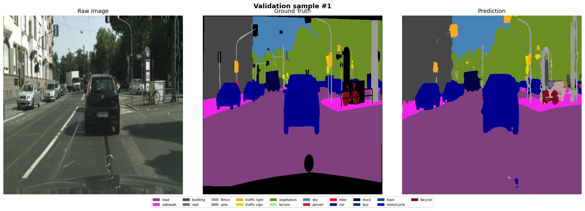
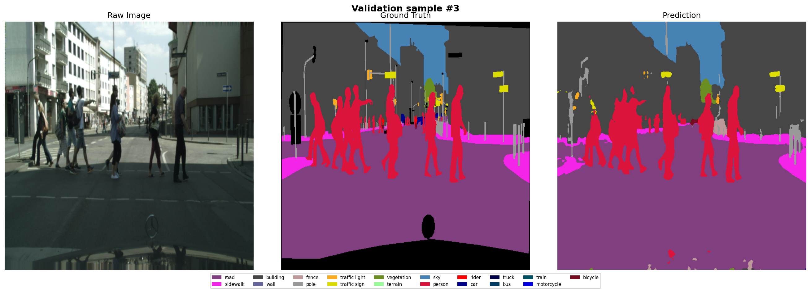
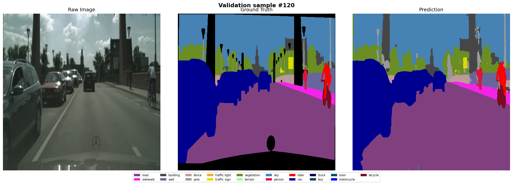
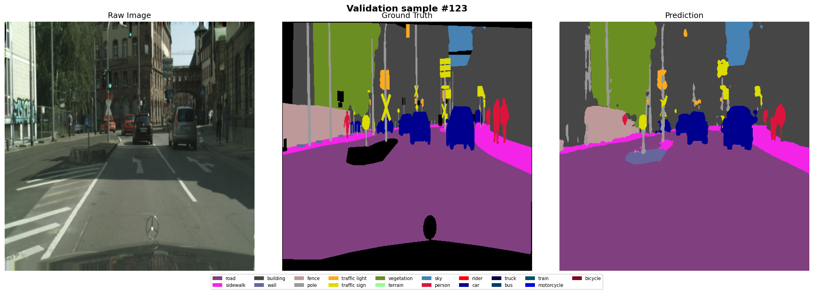
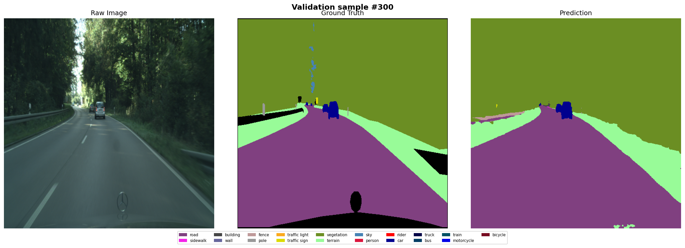

# 🏙️ Cityscapes Semantic Segmentation with SegFormer-B2

Semantic segmentation model trained on the Cityscapes dataset using SegFormer-B2.
The model classifies every pixel in a street scene into 19 classes such as road,
building, person, car, sky, and more.

🔗 **Live Demo:** [Hugging Face Spaces](https://huggingface.co/spaces/Thomaslam1202/Cityscapes_Segmentation_Model)

---

## 📸 Example Results

---

## 🏗️ Model Architecture

- **Backbone:** SegFormer-B2 (`nvidia/mit-b2`)
- **Head:** Lightweight MLP decode head
- **Input size:** 512 × 512
- **Number of classes:** 19

---

## 📊 Training Details

| Parameter | Value |
|-----------|-------|
| Epochs | 80 |
| Batch size | 16 |
| Backbone LR | 6e-5 |
| Head LR | 6e-4 |
| Optimizer | AdamW |
| Scheduler | Polynomial LR |
| Loss | 0.7 × CrossEntropy + 0.3 × Dice |
| Mixed precision | AMP (float16) |
| Augmentation | Random flip, crop, color jitter |

---

## 🗂️ Dataset

The [Cityscapes dataset](https://www.cityscapes-dataset.com/) contains high
resolution street scene images from 50 cities. It provides pixel-level annotations
for 19 semantic classes covering urban environments.

| Split | Images |
|-------|--------|
| Train | 2,975 |
| Val   | 500 |
| Test  | 1,525 |

## 📜 License

This project is for educational and research purposes.
The Cityscapes dataset requires registration at
[cityscapes-dataset.com](https://www.cityscapes-dataset.com/).
